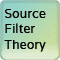

<h1>
    
    Source Filter Theory: A Materia Widget
</h1>

This is a simple tutorial of source filter theory for vowel sounds like 'ee', 'ah', and 'oo'. Source Filter Theory is designed for use with [Materia](https://github.com/ucfopen/Materia), an open-source platform for interactive course content developed by the University of Central Florida.

### Basic Use

In a production evironment, Source Filter Theory is installed to your Materia instance and is accessed via the Widget Catalog. For development, Source Filter Theory is bundled with the [Materia Widget Development Kit](https://github.com/ucfopen/Materia-Widget-Dev-Kit), which allows for rapid development in a local context using express.js.

### Local Development

Source Filter Theory uses the Materia Widget Development Kit for location development. Check out [the docs for the MDK](https://ucfopen.github.io/Materia-Docs/develop/materia-widget-development-kit.html) to learn more about starting up the local express environment.

### Installation to Materia

Widget installation options are covered in the [Installing Widgets](https://ucfopen.github.io/Materia-Docs/admin/installing-widgets.html) section of the Materia Docs.

For more information about the widget development process, be sure to visit the [widget developer guide](https://ucfopen.github.io/Materia-Docs/develop/widget-developer-guide.html) for Materia.
